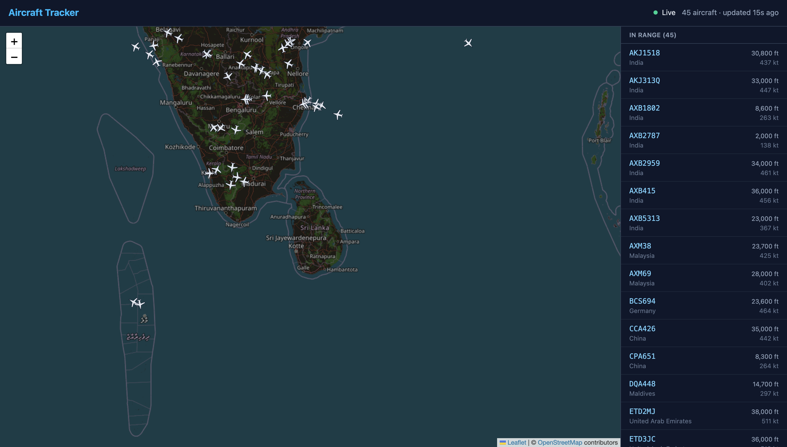
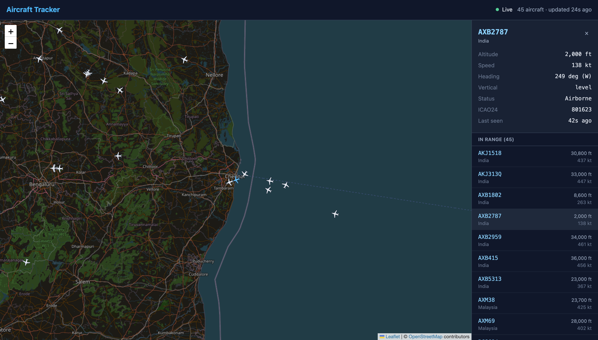
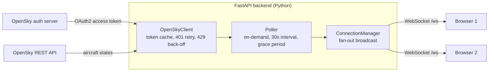

# Aircraft Tracker

Real-time aircraft tracking over South Asian airspace. A Python/FastAPI backend polls the OpenSky Network, then pushes live positions over WebSockets to a React + TypeScript map.





## Features

- Live aircraft positions on an interactive map, centred on Sri Lanka and covering southern India and the Maldives
- Markers rotated to each aircraft's heading
- Sidebar listing every aircraft in range, with a detail panel for altitude, speed, heading and vertical rate in aviation units
- Automatic reconnection with exponential back-off if the connection drops
- Clear connection states: connecting, live, delayed (upstream data unavailable) and reconnecting
- An honest empty state that explains sparse coverage rather than showing a blank map

## Architecture



**Data flow:**

1. A browser opens a WebSocket to `/ws`. The backend checks its `Origin` header and rejects unknown sites.
2. The first viewer starts the poller. Any cached snapshot is sent immediately so the map is never blank.
3. Every 30 seconds the poller requests aircraft states for the region from OpenSky, authenticating with a cached OAuth2 token.
4. Raw state vectors are normalised into typed `Aircraft` objects, and the snapshot is broadcast to every connected viewer.
5. When the last viewer leaves, the poller waits out a grace period, then stops. No viewers means no OpenSky requests.

The backend holds state in memory only. There is no database: the application shows live data, not history.

## Key design decisions

### Poll only while someone is watching

OpenSky allows registered users 4,000 API credits per day, and a request for this region costs 3 credits. Polling every 30 seconds around the clock would need 8,640 credits per day, more than twice the budget.

The poller therefore runs **only while at least one viewer is connected**. At 30-second intervals that is 360 credits per hour, which covers roughly 11 hours of active viewing per day, while idle hours cost nothing.

### A grace period before stopping

If polling stopped the instant the last viewer left, a page refresh would stop the poller and immediately restart it, spending an extra request each time. The poller instead waits 60 seconds after the last disconnect. A viewer who returns within that window reuses the running poller and the cached snapshot at no cost. This behaviour is covered by tests that assert the exact number of upstream requests.

### One fetch, many viewers

The backend polls once and broadcasts the same snapshot to every client, so ten viewers cost the same as one. Broadcasts are sent concurrently, and a client whose send fails is dropped without affecting anyone else.

### Treat outages and bugs differently

Expected operational failures (network errors, HTTP error statuses, malformed data) are logged briefly, and the last good snapshot is re-sent marked `stale`, so the interface can say "delayed" instead of going blank. Anything else is treated as a bug and logged with a full traceback. Catching everything in one place would disguise programming errors as network outages.

### Respect upstream limits

- **401 Unauthorized:** the cached token is discarded and the request retried exactly once. A bounded retry avoids looping forever on bad credentials.
- **429 Too Many Requests:** polling pauses for the duration OpenSky specifies in its retry headers, falling back to an hour if none is given, instead of retrying every cycle.

### Widening the region after measuring coverage

The project began with a bounding box around Sri Lanka alone. Testing showed that box frequently returned zero aircraft, while the same code returned over 1,000 aircraft for central Europe. The cause is the data source: OpenSky relies on volunteer-operated ADS-B receivers, and there are very few around Sri Lanka and the Indian Ocean.

The region was widened to include Bengaluru, Chennai, Kochi and the Maldives, where coverage is better. The map still centres on Sri Lanka. The wider box moved the cost from 2 to 3 credits per request, which the on-demand design comfortably absorbs.

### An application factory for testability

The FastAPI app is built by `create_app(settings, transport)` rather than at import time. Production calls it with no arguments. Tests pass their own settings and a fake HTTP transport, so the full stack runs in tests without real credentials, network access or a `.env` file. This is also what allows CI to run with no secrets configured.

## Tech stack

| Layer | Technology | Why |
|---|---|---|
| Backend | Python 3.14, FastAPI | Native async support and first-class WebSockets; Pydantic models validate every snapshot |
| HTTP client | httpx | Async, with a pluggable transport that makes the OpenSky client fully testable |
| Configuration | pydantic-settings | Typed, validated settings; missing credentials fail at startup, not mid-request |
| Frontend | React 19, TypeScript, Vite | Typed data contract with the backend, fast development builds |
| Map | Leaflet, react-leaflet, OpenStreetMap tiles | Free and open source, no API key required |
| Styling | Tailwind CSS v4 | Consistent design tokens without a separate stylesheet to maintain |
| Testing | pytest, pytest-asyncio, Vitest | Async-aware backend tests; Vite-native frontend tests |
| Quality | Ruff, ESLint, SonarQube Cloud, GitHub Actions | Linting, formatting and static analysis enforced on every pull request |

## Getting started

### Prerequisites

- Python 3.14
- Node.js 24
- A free [OpenSky Network](https://opensky-network.org) account with an API client (Account page, then create an API client and download the credentials)

### Backend

```bash
cd backend
python3 -m venv .venv
source .venv/bin/activate
python -m pip install --require-hashes -r requirements-dev.txt

cp .env.example .env
# Edit .env and add your OpenSky client ID and secret

uvicorn app.main:create_app --factory --reload
```

The API runs at `http://127.0.0.1:8000`. Interactive API documentation is available at `/docs`, and `/health` reports the poller's current state.

The `--factory` flag is required: it tells Uvicorn that `create_app` is a function that builds the application.

### Frontend

In a second terminal:

```bash
cd frontend
npm ci
npm run dev
```

Open `http://localhost:5173`.

### Configuration

**Backend** (`backend/.env`):

| Variable | Required | Default | Description |
|---|---|---|---|
| `OPENSKY_CLIENT_ID` | Yes | | OpenSky API client ID |
| `OPENSKY_CLIENT_SECRET` | Yes | | OpenSky API client secret |
| `POLL_INTERVAL_S` | No | `30` | Seconds between polls; minimum 5 |
| `POLLER_GRACE_PERIOD_S` | No | `60` | Seconds to keep polling after the last viewer leaves |
| `HTTP_TIMEOUT_S` | No | `15` | Timeout for OpenSky requests |
| `ALLOWED_ORIGINS` | No | `["http://localhost:5173"]` | JSON list of origins allowed to connect |
| `REGION_LAMIN`, `REGION_LOMIN`, `REGION_LAMAX`, `REGION_LOMAX` | No | `2`, `72`, `16`, `88` | Bounding box in degrees |

**Frontend** (`frontend/.env.development`):

| Variable | Default | Description |
|---|---|---|
| `VITE_WS_URL` | `ws://127.0.0.1:8000/ws` | Backend WebSocket URL |

`VITE_` variables are embedded in the JavaScript bundle and visible to anyone using the site. They must never contain secrets, which is why OpenSky credentials live only on the backend.

## Testing

```bash
# Backend: unit, lifecycle and API integration tests, with coverage
cd backend
pytest --cov --cov-report=term-missing

# Frontend: unit tests for state derivation and formatting
cd frontend
npm test
```

No test touches the real network. The backend suite replaces OpenSky with a fake built on `httpx.MockTransport`, which records every request, so tests can assert not only results but also how many upstream calls were made.

**Backend coverage includes:**

- Normalisation of raw OpenSky state vectors, including missing positions, padded callsigns and null measurements
- Token caching and refresh, the single 401 retry, and 429 handling with each form of retry header
- Poller lifecycle: starting once, the grace period, a returning viewer costing no extra requests, and stopping cleanly
- Stale-data handling, and rate-limit pauses lasting exactly as long as the server requests
- API integration: origin rejection before any credits are spent, CORS in both directions, and two viewers sharing one fetch

**Frontend coverage includes:**

- Feed state derivation, with boundary tests either side of the 90-second staleness threshold
- Unit conversion and formatting, including locale-independent assertions and clock skew between server and browser

### Continuous integration

Every pull request runs two parallel GitHub Actions jobs:

- **Backend:** Ruff lint, Ruff formatting check, pytest with coverage
- **Frontend:** ESLint, TypeScript type-check and production build, Vitest

SonarQube Cloud also analyses every pull request for bugs, code smells and security issues.

## Security

- **Secrets stay on the server.** OpenSky credentials are read from environment variables, never committed, and never sent to the browser.
- **Origin checks on WebSockets.** FastAPI's CORS middleware does not apply to WebSocket connections, so `/ws` validates the `Origin` header itself. Connections from unknown sites are rejected before the poller starts, so they cannot spend the API budget.
- **Least privilege.** The API only allows `GET` across origins, and the CI workflow's token is read-only.
- **Hash-locked dependencies.** Python dependencies are compiled with pip-tools into lock files containing SHA-256 hashes, and CI installs with `--require-hashes`. Frontend dependencies are installed with `npm ci`, which verifies the integrity hashes in `package-lock.json`.
- **No install-time code execution in CI.** Python packages are installed as prebuilt wheels only (`--only-binary :all:`), and npm packages with `--ignore-scripts`, closing a common route for malicious packages.

### Updating dependencies

```bash
cd backend
pip-compile --generate-hashes --upgrade --output-file requirements.txt requirements.in
pip-compile --generate-hashes --upgrade --output-file requirements-dev.txt requirements-dev.in
pip-sync requirements-dev.txt
pytest
```

Edit the `.in` files to add or remove direct dependencies. The `.txt` files are generated and should not be edited by hand.

## Project structure

```
aircraft-tracker/
├── backend/
│   ├── app/
│   │   ├── config.py              Typed settings loaded from the environment
│   │   ├── models.py              Aircraft model and state-vector normalisation
│   │   ├── opensky_client.py      OAuth2 token handling, retries, rate limits
│   │   ├── poller.py              On-demand polling loop and grace period
│   │   ├── connection_manager.py  WebSocket clients and broadcasting
│   │   └── main.py                Application factory and routes
│   ├── tests/                     pytest suite and test fakes
│   ├── requirements.in            Direct dependencies
│   └── requirements-dev.in        Development and test dependencies
├── frontend/
│   └── src/
│       ├── useAircraftSocket.ts   WebSocket hook with reconnection
│       ├── feedState.ts           Derives the connection state shown to users
│       ├── format.ts              Unit conversion and display formatting
│       ├── MapView.tsx            Leaflet map and markers
│       ├── Sidebar.tsx            Aircraft list and empty states
│       └── AircraftDetail.tsx     Selected aircraft panel
└── .github/workflows/ci.yml       Continuous integration
```

## Limitations and future work

- **Coverage depends on volunteers.** OpenSky's receiver network is sparse over this region, so traffic can be intermittent, especially at night.
- **Live data only.** Nothing is stored, so there is no history, replay or analysis of past traffic. Persisting snapshots in PostgreSQL would enable statistics such as busiest periods and altitude distributions.
- **Types are kept in sync by hand.** The TypeScript interfaces mirror the Pydantic models manually. They could be generated from FastAPI's OpenAPI schema instead.
- **Single process.** The poller and client list live in one process. Running several backend instances would need a shared layer, such as Redis publish/subscribe, so that only one instance polls OpenSky.
- **Positions update every 30 seconds.** Markers could be animated between updates using each aircraft's speed and heading (dead reckoning).
- **Component and end-to-end tests.** Current frontend tests cover pure logic; rendering and browser-level tests would be a natural next step.

## Acknowledgements

- Aircraft data from [The OpenSky Network](https://opensky-network.org)
- Map data and tiles © [OpenStreetMap](https://www.openstreetmap.org/copyright) contributors

## Licence

Released under the [MIT Licence](LICENSE).